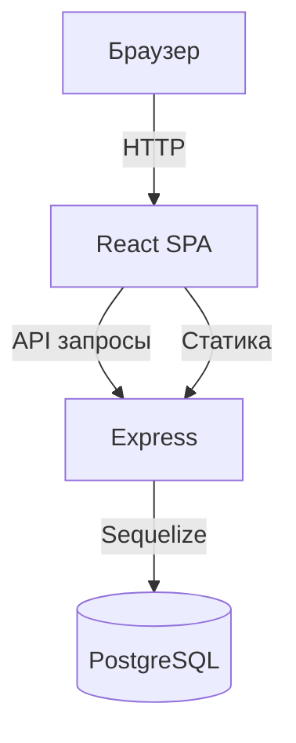

# Kanban Task Board


## Обзор

Kanban Task Board — это полнофункциональное веб-приложение для управления задачами по методологии Kanban. Пользователи могут создавать колонки (статусы), добавлять задачи и перетаскивать их между колонками, изменяя порядок и статус в реальном времени.

Приложение построено по архитектуре **клиент‑сервер** с использованием современных технологий: React на фронтенде, Express на бэкенде и PostgreSQL в качестве базы данных. Оно поддерживает оптимистичные обновления интерфейса, транзакционную целостность при перемещении задач и готово к развёртыванию в production.

## Технологический стек

### Клиентская часть
- **React 18** – функциональные компоненты, хуки
- **Vite 4** – сборка и dev‑сервер
- **CSS Modules** – изолированные стили
- **Нативный Drag‑and‑Drop API** – перетаскивание без сторонних библиотек

### Серверная часть
- **Node.js** (ES‑модули)
- **Express** – фреймворк для REST API
- **Sequelize 6** – ORM для работы с базой данных
- **PostgreSQL** – реляционная база данных

### Инфраструктура
- **dotenv** – управление переменными окружения
- **CORS** – обработка кросс‑доменных запросов
- **Nodemon** – автоматическая перезагрузка в разработке

## Архитектура

Приложение следует классической трёхслойной архитектуре:

1. **Клиент (React SPA)** – предоставляет пользовательский интерфейс, обрабатывает drag‑and‑drop, отправляет запросы к API.
2. **Сервер (Express)** – принимает HTTP‑запросы, выполняет бизнес‑логику, взаимодействует с базой данных.
3. **База данных (PostgreSQL)** – хранит колонки и задачи, обеспечивает целостность отношений.



### Модели данных

#### Колонка (Column)
| Поле | Тип | Описание |
|------|-----|----------|
| id | UUID | Уникальный идентификатор |
| title | STRING | Название колонки |
| order | INTEGER | Порядок отображения |
| createdAt | TIMESTAMP | Дата создания |
| updatedAt | TIMESTAMP | Дата обновления |

#### Задача (Task)
| Поле | Тип | Описание |
|------|-----|----------|
| id | UUID | Уникальный идентификатор |
| content | TEXT | Текст задачи |
| order | INTEGER | Порядок внутри колонки |
| columnId | UUID | Внешний ключ к колонке |
| createdAt | TIMESTAMP | Дата создания |
| updatedAt | TIMESTAMP | Дата обновления |

**Связь:** Одна колонка содержит множество задач (`Column.hasMany(Task)`), каждая задача принадлежит одной колонке (`Task.belongsTo(Column)`).

## Быстрый старт

Чтобы запустить проект локально за 5 минут:

1. **Клонируйте репозиторий:**
   ```bash
   git clone <URL-вашего-репозитория>
   cd kanban-main
   ```

2. **Запустите серверную часть:**
   ```bash
   cd server
   npm install
   cp .env.example .env   # настройте переменные окружения
   npm run dev
   ```

3. **Запустите клиентскую часть:**
   ```bash
   cd ../client
   npm install
   npm run dev
   ```

4. **Откройте браузер** по адресу [http://localhost:3000](http://localhost:3000).

## Установка и запуск

### Предварительные требования
- Node.js 16 или выше
- PostgreSQL 12+
- npm или yarn

### Шаг 1: Настройка базы данных
1. Установите PostgreSQL и создайте базу данных (например, `kanban_db`).
2. Настройте учётные данные в файле `server/.env` (см. `server/.env.example`).

### Шаг 2: Запуск сервера
```bash
cd server
npm install
npm run dev   # режим разработки (с hot‑reload)
# или
npm start     # production‑режим
```

Сервер будет доступен на `http://localhost:5000`.

### Шаг 3: Запуск клиента
```bash
cd client
npm install
npm run dev   # запуск dev‑сервера на порту 3000
```

Клиент автоматически проксирует запросы к `/api` на сервер.

### Шаг 4: Сборка для production
Чтобы собрать клиент и запустить единый сервер, который раздаёт статику:

```bash
cd client
npm run build   # создаст папку dist
cd ../server
npm start       # сервер будет обслуживать client/dist
```

Или используйте скрипт деплоя `deploy.sh` (см. ниже).

## Структура проекта

```
kanban-main/
├── client/                 # React‑приложение
│   ├── src/
│   │   ├── components/    # React‑компоненты (Board, Column, Task...)
│   │   ├── services/      # API‑клиент (api.js)
│   │   ├── App.jsx
│   │   └── main.jsx
│   ├── public/
│   ├── vite.config.js
│   └── README.md          # Документация клиента
├── server/                # Express‑сервер
│   ├── config/           # Конфигурация БД
│   ├── controllers/      # Логика обработки запросов
│   ├── models/           # Sequelize‑модели
│   ├── routes/           # Маршруты API
│   ├── index.js
│   └── README.md         # Документация сервера
├── deploy.sh             # Скрипт для развёртывания
└── README.md             # Этот файл
```

### Скрипт деплоя (`deploy.sh`)
Скрипт автоматизирует развёртывание на чистом сервере (Debian/Ubuntu). Он выполняет:
1. Установку Node.js 20
2. Установку и настройку PostgreSQL
3. Установку зависимостей сервера и клиента
4. Сборку клиентской части
5. Запуск сервера на порту 5000

Для использования:
```bash
chmod +x deploy.sh
./deploy.sh
```

Скрипт предполагает, что вы находитесь в корне проекта. После выполнения приложение будет доступно по адресу `http://IP_СЕРВЕРА:5000`.

Подробности см. в файле [deploy.sh](deploy.sh).

## Ссылки на подпроекты

- **[Клиентская часть](client/README.md)** – полная документация по React‑приложению, компонентам и workflow.
- **[Серверная часть](server/README.md)** – детальное описание API, моделей и настройки сервера.

## Документация

### API Endpoints

| Метод | Путь | Описание |
|-------|------|----------|
| GET | `/api/board` | Получить все колонки с задачами |
| POST | `/api/columns` | Создать колонку |
| POST | `/api/tasks` | Создать задачу |
| PATCH | `/api/tasks/:id/move` | Переместить задачу (изменить колонку/порядок) |
| POST | `/api/tasks/bulk-update` | Массовое обновление порядка задач |
| POST | `/api/columns/:id/reorder` | Изменить порядок задач внутри колонки |

Подробнее см. [server/README.md](server/README.md#6-роуты-api-endpoints).

### Логика перемещения задач

Алгоритм перемещения гарантирует целостность данных и корректный порядок:

1. **Перемещение внутри одной колонки:** порядок задач обновляется сдвигом элементов между старой и новой позицией.
2. **Перемещение между колонками:** задача удаляется из исходной колонки (сдвиг оставшихся вверх) и вставляется в целевую колонку (сдвиг вниз).
3. **Транзакция:** все изменения выполняются внутри транзакции Sequelize; при ошибке происходит откат.

Подробное описание с примерами кода см. в [технической документации](#техническая-документация).

### Компоненты React

- **Board** – корневой компонент, управляет состоянием доски и обработкой drag‑and‑drop.
- **Column** – отображает колонку со списком задач.
- **Task** – отдельная задача, перетаскиваемый элемент.
- **AddColumn / AddTask** – формы для создания новых элементов.

Полное описание компонентов, пропсов и состояния – в [client/README.md](client/README.md#4-компоненты).

## Разработка

### Внесение изменений
1. Создайте ветку от `main`.
2. Внесите изменения, следуя стилю кода проекта.
3. Протестируйте локально (клиент + сервер).
4. Создайте pull request с описанием изменений.

### Тестирование
Пока что автоматические тесты отсутствуют. Ручное тестирование включает:
- Добавление колонок и задач.
- Drag‑and‑drop внутри колонки и между колонками.
- Проверка сохранения состояния после перезагрузки страницы.
- Валидация API‑запросов через инструменты разработчика.

### Возможные улучшения
1. **TypeScript** – добавить типизацию для повышения надёжности.
2. **Unit‑тесты** – покрыть компоненты и API.
3. **Глобальное состояние** – внедрить Context API или Redux Toolkit.
4. **PWA** – превратить в Progressive Web App.
5. **Дополнительные функции** – редактирование задач, цветовые метки, дедлайны, архивирование.

## Лицензия

Проект распространяется под лицензией MIT. Подробнее см. файл [LICENSE](LICENSE) (если присутствует).

---

## Техническая документация

*Этот раздел содержит детали, ранее находившиеся в корневом README. Они сохранены для полноты.*

### База данных

Используется **PostgreSQL** с ORM **Sequelize**. Структура таблиц и связи описаны выше в разделе «Модели данных».

### Сервер (Express)

#### Контроллеры
Все контроллеры находятся в `server/controllers/boardController.js`:
- `getBoard` – загружает колонки с задачами.
- `createColumn`, `createTask` – создание новых элементов.
- `updateTaskOrder` – перемещение задачи (основная бизнес‑логика).
- `bulkUpdateTaskOrder`, `reorderColumnTasks` – массовые операции.

#### Конфигурация
Файл `server/.env` определяет параметры подключения к БД и порт сервера. Пример:
```
PORT=5000
DB_NAME=kanban_db
DB_USER=postgres
DB_PASS=4199
DB_HOST=localhost
```

### Клиент (React)

#### Drag‑and‑Drop реализация
Используется нативный HTML5 Drag and Drop API:
- **DragStart** – сохранение ID задачи, индекса и ID колонки.
- **DragOver** – определение позиции (above/below) и визуальная индикация.
- **Drop** – вычисление нового порядка, оптимистичное обновление UI, отправка запроса на сервер.

**Важно:** Индекс сохраняется до изменения массива, чтобы избежать сдвига после `splice`.

#### Оптимистичные обновления
Локальное состояние обновляется сразу после действия пользователя, затем отправляется асинхронный запрос. При ошибке состояние откатывается через повторную загрузку данных с сервера.

### Конфигурация Vite (`client/vite.config.js`)
Прокси‑настройки для разработки:
```javascript
server: {
  proxy: {
    '/api': {
      target: 'http://localhost:5000',
      changeOrigin: true,
    }
  }
}
```

### Деплой на продакшн
В production сервер раздаёт статику из `client/dist` и обрабатывает API‑запросы. Все остальные маршруты возвращают `index.html` для поддержки SPA‑роутинга.

Команда сборки: `npm run build` в папке `client`.
