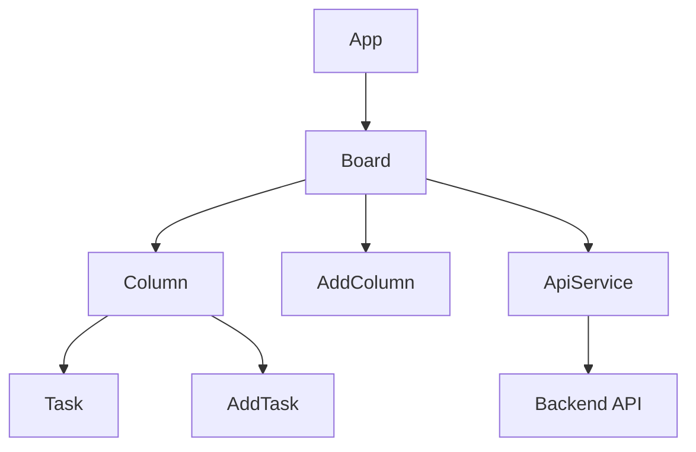

# Клиентская часть приложения Kanban Task Board

## 1. Обзор

Клиентская часть представляет собой одностраничное приложение (SPA) для управления задачами по методологии Kanban. Пользователь может создавать колонки (статусы), добавлять задачи, перетаскивать их между колонками и изменять порядок внутри колонок.

**Технологический стек:**
- **Frontend:** React 18 (функциональные компоненты, хуки)
- **Сборка:** Vite 4 (быстрая разработка с HMR)
- **Стилизация:** CSS Modules (изоляция стилей)
- **Серверное взаимодействие:** REST API (нативный `fetch`)
- **Состояние:** Локальное состояние React (useState, useEffect)

**Связь с сервером:** Клиент обращается к бэкенду через прокси‑сервер Vite на `localhost:5000`. Все API‑запросы направляются на эндпоинты `/api/*`. Серверная часть реализована на Node.js (Express) с базой данных PostgreSQL (через Sequelize).

## 2. Архитектура

Приложение построено по компонентной архитектуре с однонаправленным потоком данных. Главный компонент `App` рендерит `Board`, который управляет состоянием колонок и задач. Каждая колонка (`Column`) содержит список задач (`Task`) и форму добавления новой задачи (`AddTask`). Дополнительно присутствуют компоненты `AddColumn` (добавление колонки) и сервисы для работы с API.



**Поток данных:**
1. При монтировании `Board` вызывает `api.getBoard()` и получает массив колонок с задачами.
2. Данные сохраняются в состоянии `columns` и передаются вниз по иерархии.
3. Пользовательские действия (добавление, перемещение) вызывают методы `Board`, которые:
   - Оптимистично обновляют локальное состояние.
   - Отправляют соответствующий запрос на сервер.
   - В случае ошибки откатывают изменения и перезагружают данные.

## 3. Структура проекта

```
client/
├── public/                 # Статические ресурсы
├── src/
│   ├── components/         # React‑компоненты
│   │   ├── Board.jsx
│   │   ├── Column.jsx
│   │   ├── Task.jsx
│   │   ├── AddColumn.jsx
│   │   └── AddTask.jsx
│   ├── services/          # Логика работы с API
│   │   ├── api.js         # Класс ApiService
│   │   └── taskService.js # Серверная логика (используется на бэкенде)
│   ├── App.jsx            # Корневой компонент
│   ├── main.jsx           # Точка входа
│   └── index.css          # Глобальные стили
├── vite.config.js         # Конфигурация Vite
├── package.json           # Зависимости и скрипты
└── README.md              # Этот файл
```

## 4. Компоненты

### Board (`Board.jsx`)
Главный компонент, отвечающий за отображение всех колонок и управление состоянием доски.

**Пропсы:** отсутствуют (получает данные самостоятельно).

**Состояние:**
- `columns` – массив колонок (каждая содержит `id`, `title`, `order`, `tasks`).
- `loading` – флаг загрузки.
- `draggedTask` – объект перетаскиваемой задачи (`{ id, sourceColumnId, sourceIndex, task }`).

**Ключевые методы:**
- `fetchBoard()` – загрузка данных с сервера.
- `handleAddColumn(title)` – создание новой колонки.
- `handleAddTask(columnId, content)` – добавление задачи в указанную колонку.
- `handleDragStart`, `handleDragEnd`, `handleDragOver`, `handleDrop` – обработка drag‑and‑drop.
- `handleSameColumnReorder`, `handleCrossColumnMove` – логика перемещения задач.

### Column (`Column.jsx`)
Отображает одну колонку со списком задач и кнопкой добавления.

**Пропсы:**
- `column` – объект колонки.
- `onAddTask(columnId, content)` – callback добавления задачи.
- `onDragStart`, `onDragEnd`, `onDragOver`, `onDrop`, `onTaskDrop` – события drag‑and‑drop.

**Состояние:**
- `isDraggingOver` – находится ли над колонкой перетаскиваемый элемент.
- `draggedOverTaskId` – ID задачи, над которой в данный момент находится курсор.
- `dragPosition` – позиция относительно задачи (`'above'` или `'below'`).

### Task (`Task.jsx`)
Отдельная задача, которую можно перетаскивать.

**Пропсы:**
- `task` – объект задачи (`{ id, content, order }`).
- `columnId` – ID родительской колонки.
- `index` – порядковый индекс в колонке.
- `onDragStart(e, taskId, columnId, index)` – вызывается при начале перетаскивания.
- `onDragEnd(e)` – при завершении.

### AddColumn (`AddColumn.jsx`)
Кнопка и форма для создания новой колонки.

**Пропсы:**
- `onAdd(title)` – callback с названием новой колонки.

**Состояние:**
- `isAdding` – отображать ли форму.
- `title` – введённое название.

### AddTask (`AddTask.jsx`)
Кнопка и форма для добавления задачи в колонку.

**Пропсы:**
- `columnId` – ID колонки, в которую будет добавлена задача.
- `onAdd(columnId, content)` – callback с содержимым задачи.

**Состояние:**
- `isAdding` – отображать ли форму.
- `content` – текст задачи.

## 5. Сервисы

### ApiService (`src/services/api.js`)
Класс‑синглтон, инкапсулирующий все HTTP‑запросы к бэкенду.

**Эндпоинты:**
- `GET /api/board` – получить всю доску (колонки с задачами).
- `POST /api/columns` – создать колонку.
- `POST /api/tasks` – создать задачу.
- `PATCH /api/tasks/:id/move` – переместить задачу (изменить колонку и/или порядок).
- `POST /api/tasks/bulk-update` – массовое обновление порядка задач (не используется в текущей реализации).
- `POST /api/columns/:columnId/reorder` – изменить порядок задач внутри колонки (не используется).

**Пример использования:**
```javascript
import api from './services/api.js';

// Получить доску
const board = await api.getBoard();

// Создать колонку
const newColumn = await api.createColumn({ title: 'Новая', order: 0 });

// Создать задачу
const newTask = await api.createTask({
  content: 'Изучить React',
  columnId: 'uuid',
  order: 0
});

// Переместить задачу
await api.updateTaskOrder(taskId, {
  columnId: newColumnId,
  order: newIndex,
  oldColumnId: oldColumnId,
  oldOrder: oldIndex
});
```

### Оптимистичные обновления
При любом пользовательском действии (добавление, перемещение) сначала обновляется локальное состояние, затем отправляется асинхронный запрос. Если запрос завершается ошибкой, состояние откатывается (через повторную загрузку данных с сервера). Это обеспечивает мгновенный отклик интерфейса.

**Обработка ошибок:** Все методы ApiService выбрасывают `Error` при неудачном HTTP‑ответе. Ошибки перехватываются в компонентах, логируются в консоль и, при необходимости, вызывают `fetchBoard()` для восстановления актуального состояния.

## 6. Рабочий процесс (Workflow)

### Загрузка доски
1. `Board` монтируется, `useEffect` вызывает `fetchBoard()`.
2. `fetchBoard()` вызывает `api.getBoard()`.
3. Полученные данные сохраняются в `setColumns(columns)`.
4. Колонки и задачи отрисовываются.

### Добавление колонки
1. Пользователь нажимает «+ Добавить колонку».
2. `AddColumn` открывает форму, принимает название.
3. При отправке формы вызывается `handleAddColumn(title)` в `Board`.
4. `Board` отправляет `api.createColumn({ title, order })`.
5. Оптимистично добавляет новую колонку в `columns`.
6. При успешном ответе сервера колонка уже присутствует; при ошибке – состояние откатывается.

### Добавление задачи
1. В колонке пользователь нажимает «+ Добавить задачу».
2. `AddTask` открывает форму, принимает содержание.
3. При отправке вызывается `handleAddTask(columnId, content)`.
4. `Board` отправляет `api.createTask({ content, columnId, order })`.
5. Оптимистично добавляет задачу в массив `tasks` соответствующей колонки.

### Drag‑and‑drop (детальный алгоритм)
1. **Начало перетаскивания:** `Task` вызывает `onDragStart`, `Board` сохраняет информацию о перетаскиваемой задаче в `draggedTask`.
2. **Перетаскивание над колонкой:** `Column` отслеживает события `dragOver` и визуально подсвечивает область.
3. **Перетаскивание над задачей:** `Column` определяет позицию (`above`/`below`) и подсвечивает разделитель.
4. **Бросок:** При `drop` вызывается `handleDrop` в `Board` с параметрами `targetColumnId` и `targetIndex`.
5. **Логика перемещения:**
   - Если `sourceColumnId === targetColumnId` – перестановка внутри колонки (`handleSameColumnReorder`).
   - Иначе – перемещение между колонками (`handleCrossColumnMove`).
6. **Оптимистичное обновление:** `Board` модифицирует `columns`, переставляя задачу в новую позицию.
7. **Синхронизация с сервером:** Отправляется `api.updateTaskOrder` с новыми `columnId` и `order`.
8. **Обработка ошибок:** В случае неудачи вызывается `fetchBoard()` для восстановления актуальных данных.

**Пример кода обработки drop:**
```javascript
const handleDrop = async (e, targetColumnId, targetIndex = null) => {
  e.preventDefault();
  if (!draggedTask) return;

  const { id: taskId, sourceColumnId, sourceIndex } = draggedTask;

  // Определение целевого индекса
  let finalTargetIndex = targetIndex;
  if (finalTargetIndex === null) {
    const targetColumn = columns.find(col => col.id === targetColumnId);
    finalTargetIndex = targetColumn.tasks?.length || 0;
  }

  // Логика перемещения
  if (sourceColumnId === targetColumnId) {
    await handleSameColumnReorder(sourceColumnId, sourceIndex, finalTargetIndex);
  } else {
    await handleCrossColumnMove(taskId, sourceColumnId, targetColumnId,
                                sourceIndex, finalTargetIndex);
  }

  setDraggedTask(null);
};
```

## 7. Состояние (State Management)

Управление состоянием реализовано исключительно на встроенных хуках React. Глобальный стейт‑менеджер (Redux, Context) не используется, так как приложение достаточно мало и данные не нуждаются в разделении между несвязанными компонентами.

**Данные, хранящиеся в состоянии:**
- `columns` – полное представление доски (массив колонок, каждая с массивом задач).
- `loading` / `error` – статус загрузки и ошибки.
- `draggedTask` – временные данные о перетаскиваемой задаче.

**Синхронизация с сервером:** После каждого изменения, влияющего на персистентные данные (создание, перемещение), отправляется соответствующий API‑запрос. Локальное состояние обновляется оптимистично, что создаёт иллюзию мгновенного отклика.

## 8. Маршрутизация

Приложение является одностраничным (SPA) и не использует маршрутизацию. Все взаимодействие происходит в рамках одного экрана – доски. При необходимости расширения (например, добавления страниц настроек, истории) можно подключить `react-router-dom`.

## 9. Настройка сборки и запуска

### Скрипты (package.json)
```json
"scripts": {
  "dev": "vite",           # Запуск dev‑сервера на http://localhost:3000
  "build": "vite build",   # Сборка для production
  "preview": "vite preview" # Предпросмотр собранного приложения
}
```

### Конфигурация Vite (`vite.config.js`)
```javascript
import { defineConfig } from 'vite'
import react from '@vitejs/plugin-react'

export default defineConfig({
  plugins: [react()],
  server: {
    port: 3000,
    proxy: {
      '/api': {
        target: 'http://localhost:5000',  // Бэкенд‑сервер
        changeOrigin: true,
      }
    }
  }
})
```

**Прокси:** Все запросы к `/api` перенаправляются на `localhost:5000`, где работает серверная часть. Это позволяет избежать проблем с CORS во время разработки.

**Порты:** 
- Клиент: `3000`
- Сервер: `5000`

### Переменные окружения
В текущей реализации переменные окружения не используются. При необходимости можно создать `.env` файл с настройками (например, `VITE_API_BASE_URL`).

## 10. Зависимости

**Основные (dependencies):**
- `react` ^18.2.0 – библиотека для построения интерфейсов.
- `react-dom` ^18.2.0 – рендеринг React в DOM.

**Разработка (devDependencies):**
- `@vitejs/plugin-react` ^4.0.3 – плагин Vite для поддержки React.
- `vite` ^4.4.5 – сборщик и dev‑сервер.
- `@types/react`, `@types/react-dom` – типы для TypeScript (не используются в текущем JavaScript‑проекте, но присутствуют для совместимости).

## 11. Разработка и отладка

### Запуск в режиме разработки
1. Убедитесь, что серверная часть запущена на порту 5000.
2. В директории `client` выполните:
   ```bash
   npm install
   npm run dev
   ```
3. Откройте браузер по адресу `http://localhost:3000`.

### Проверка API
- Используйте инструменты разработчика (вкладка Network) для мониторинга HTTP‑запросов.
- Все запросы к API будут отображаться с префиксом `/api`.
- При ошибках (4xx, 5xx) в консоли появится соответствующее сообщение.

### Тестирование
Пока что автоматические тесты отсутствуют. Ручное тестирование включает:
- Добавление колонок и задач.
- Перетаскивание задач внутри колонки и между колонками.
- Проверка сохранения состояния после перезагрузки страницы (данные хранятся в БД на сервере).

## 12. Возможные улучшения

1. **TypeScript** – добавить типизацию для повышения надёжности и удобства разработки.
2. **Глобальное состояние** – при росте приложения можно внедрить Context API или Redux Toolkit для централизованного управления состоянием.
3. **Тестирование** – написать unit‑тесты (Jest + React Testing Library) для компонентов и интеграционные тесты для сценариев drag‑and‑drop.
4. **Оптимизации производительности:**
   - Мемоизация компонентов (`React.memo`, `useCallback`).
   - Виртуализация списка задач для колонок с большим количеством элементов.
5. **Дополнительные функции:**
   - Редактирование задач и колонок.
   - Цветовые метки, дедлайны, прикрепление файлов.
   - Возможность архивирования задач.
   - Авторизация и несколько досок.
6. **PWA** – превратить приложение в Progressive Web App с офлайн‑режимом.

---
