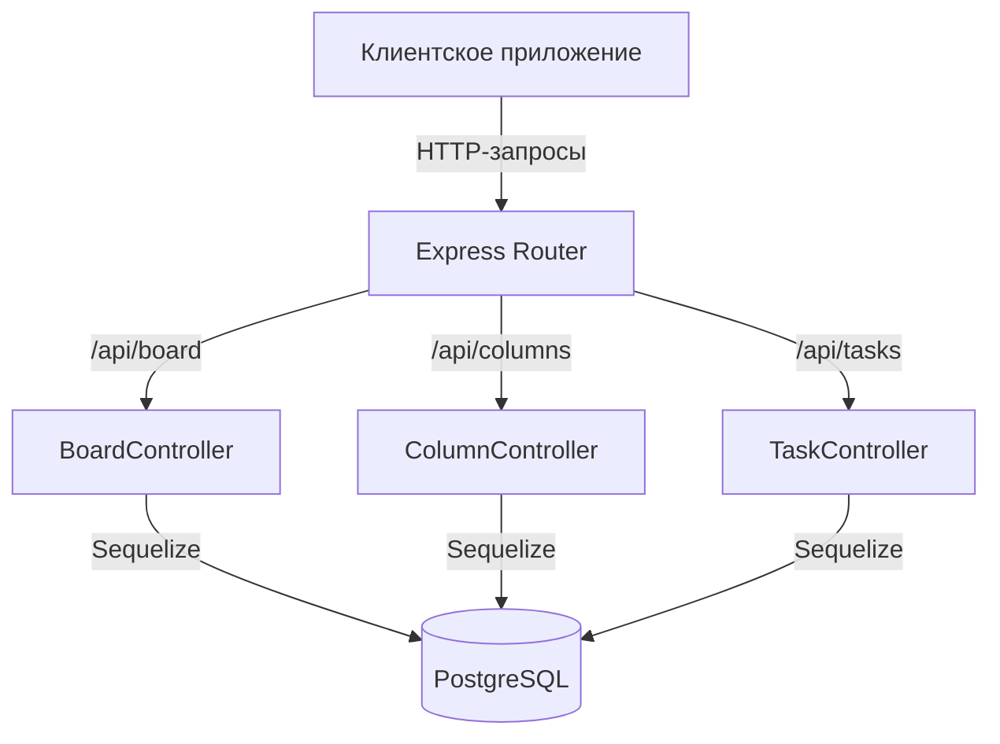

# Серверная часть приложения Kanban Task Board

## 1. Обзор

Серверная часть представляет собой RESTful API, построенное на стеке **Node.js + Express + Sequelize + PostgreSQL**. Она обеспечивает хранение данных (колонки и задачи), обработку бизнес-логики и предоставление эндпоинтов для клиентского приложения Kanban.

**Основные функции:**
- Управление колонками (создание, получение списка)
- Управление задачами (создание, перемещение между колонками, изменение порядка)
- Поддержка транзакционной целостности при операциях drag‑and‑drop
- Автоматическая синхронизация моделей с базой данных
- Раздача статического фронтенда в production‑режиме

**Технологический стек:**
- **Runtime:** Node.js (ES‑модули)
- **Фреймворк:** Express.js
- **ORM:** Sequelize 6
- **База данных:** PostgreSQL
- **Дополнительно:** CORS, dotenv, nodemon (для разработки)

## 2. Архитектура

Сервер построен по классической трёхслойной архитектуре:

1. **Маршрутизация (Routes)** – определяет эндпоинты API и связывает их с контроллерами.
2. **Контроллеры (Controllers)** – обрабатывают HTTP‑запросы, вызывают бизнес‑логику и взаимодействуют с моделями.
3. **Модели (Models)** – описывают структуру данных и отношения между таблицами БД.
4. **Конфигурация БД (Database Config)** – настройка подключения к PostgreSQL через Sequelize.



**Поток данных:**
1. Клиент отправляет HTTP‑запрос на соответствующий эндпоинт.
2. Express маршрутизирует запрос в нужный контроллер.
3. Контроллер валидирует входные данные, выполняет операции с базой через Sequelize.
4. Результат возвращается клиенту в формате JSON.

## 3. Структура проекта

```
server/
├── config/
│   └── db.js                 # Конфигурация подключения к БД (Sequelize)
├── controllers/
│   └── boardController.js    # Все контроллеры (колонки, задачи, доска)
├── models/
│   ├── Column.js             # Модель колонки
│   ├── Task.js               # Модель задачи
│   └── index.js              # Инициализация моделей и связей
├── routes/
│   └── boardRoutes.js        # Определение маршрутов API
├── .env                      # Переменные окружения (не в репозитории)
├── .env.example              # Пример переменных окружения
├── index.js                  # Точка входа сервера
├── package.json              # Зависимости и скрипты
└── README.md                 # Этот файл
```

## 4. Модели

### Column (колонка)

| Поле   | Тип          | Описание                          |
|--------|--------------|-----------------------------------|
| id     | UUID         | Первичный ключ, генерируется автоматически |
| title  | STRING       | Название колонки (обязательное)   |
| order  | INTEGER      | Порядковый номер для сортировки (по умолчанию 0) |
| createdAt | TIMESTAMP | Дата создания (автоматически)     |
| updatedAt | TIMESTAMP | Дата обновления (автоматически)   |

**Связи:** Одна колонка может содержать множество задач (`Column.hasMany(Task)`).

### Task (задача)

| Поле    | Тип          | Описание                          |
|---------|--------------|-----------------------------------|
| id      | UUID         | Первичный ключ, генерируется автоматически |
| content | TEXT         | Текст задачи (обязательное)       |
| order   | INTEGER      | Порядок внутри колонки (по умолчанию 0) |
| columnId| UUID         | Внешний ключ, ссылается на колонку |
| createdAt | TIMESTAMP | Дата создания (автоматически)     |
| updatedAt | TIMESTAMP | Дата обновления (автоматически)   |

**Индексы:** Составной индекс по `(columnId, order)` для ускорения сортировки.

**Связи:** Каждая задача принадлежит одной колонке (`Task.belongsTo(Column)`).

## 5. Контроллеры

Все контроллеры находятся в файле `boardController.js`:

### `getBoard`
- **Метод:** `GET /api/board`
- **Описание:** Возвращает всю доску – список всех колонок с вложенными задачами, отсортированными по полю `order`.
- **Ответ:** Массив объектов колонок, каждый содержит массив `tasks`.

### `createColumn`
- **Метод:** `POST /api/columns`
- **Описание:** Создаёт новую колонку.
- **Тело запроса:** `{ title: string, order?: number }`
- **Ответ:** Созданный объект колонки.

### `createTask`
- **Метод:** `POST /api/tasks`
- **Описание:** Создаёт новую задачу в указанной колонке.
- **Тело запроса:** `{ content: string, columnId: UUID, order?: number }`
- **Ответ:** Созданный объект задачи.

### `updateTaskOrder`
- **Метод:** `PATCH /api/tasks/:id/move`
- **Описание:** Обновляет позицию задачи (перемещение внутри колонки или между колонками). Использует транзакцию для гарантии целостности данных.
- **Тело запроса:** `{ columnId: UUID, order: number, oldColumnId?: UUID, oldOrder?: number }`
- **Ответ:** HTTP 200 при успехе.

### `bulkUpdateTaskOrder`
- **Метод:** `POST /api/tasks/bulk-update`
- **Описание:** Массовое обновление порядка нескольких задач (например, после множественных перемещений).
- **Тело запроса:** `{ tasks: Array<{ id: UUID, columnId: UUID, order: number }> }`
- **Ответ:** HTTP 200 при успехе.

### `reorderColumnTasks`
- **Метод:** `POST /api/columns/:columnId/reorder`
- **Описание:** Обновляет порядок задач внутри одной колонки.
- **Тело запроса:** `{ taskOrders: Array<{ id: UUID, order: number }> }`
- **Ответ:** HTTP 200 при успехе.

## 6. Роуты (API Endpoints)

| Метод | Путь | Контроллер | Описание |
|-------|------|------------|----------|
| GET | `/api/board` | `getBoard` | Получить всю доску с колонками и задачами |
| POST | `/api/columns` | `createColumn` | Создать новую колонку |
| POST | `/api/tasks` | `createTask` | Создать новую задачу |
| PATCH | `/api/tasks/:id/move` | `updateTaskOrder` | Переместить задачу (изменить колонку и/или порядок) |
| POST | `/api/tasks/bulk-update` | `bulkUpdateTaskOrder` | Массовое обновление порядка задач |
| POST | `/api/columns/:columnId/reorder` | `reorderColumnTasks` | Изменить порядок задач внутри колонки |

Все эндпоинты возвращают JSON. В случае ошибки возвращается объект `{ error: string }` с соответствующим HTTP‑статусом.

## 7. Настройка окружения

Перед запуском необходимо создать файл `.env` в директории `server/` на основе примера `.env.example` (если его нет, можно создать вручную).

**Пример содержимого `.env`:**
```env
DB_HOST=localhost
DB_PORT=5432
DB_NAME=kanban_db
DB_USER=postgres
DB_PASS=postgres
PORT=5000
```

**Описание переменных:**
- `DB_HOST` – хост PostgreSQL (по умолчанию `localhost`)
- `DB_PORT` – порт PostgreSQL (по умолчанию `5432`)
- `DB_NAME` – имя базы данных
- `DB_USER` – пользователь БД
- `DB_PASS` – пароль пользователя
- `PORT` – порт, на котором будет работать сервер (по умолчанию `5000`)

## 8. Установка и запуск

### Предварительные требования
- Установленный **Node.js** (версия 16 или выше)
- Установленный **PostgreSQL** (локально или удалённо)
- Созданная база данных с именем, указанным в `DB_NAME`

### Шаги

1. **Клонирование репозитория и переход в директорию сервера:**
   ```bash
   cd server
   ```

2. **Установка зависимостей:**
   ```bash
   npm install
   ```

3. **Настройка базы данных:**
   - Убедитесь, что PostgreSQL запущен.
   - Создайте базу данных (например, `kanban_db`).
   - Отредактируйте `.env` файл, указав правильные учётные данные.

4. **Запуск сервера в режиме разработки (с hot‑reload):**
   ```bash
   npm run dev
   ```
   Сервер будет доступен по адресу `http://localhost:5000`.

5. **Запуск в production‑режиме:**
   ```bash
   npm start
   ```

## 9. Скрипты package.json

```json
"scripts": {
  "dev": "nodemon index.js",
  "start": "node index.js"
}
```

- `npm run dev` – запускает сервер с помощью **nodemon**, который автоматически перезагружает сервер при изменениях в коде.
- `npm start` – запускает сервер в production‑режиме (обычный Node.js).

## 10. Конфигурация базы данных

Подключение к PostgreSQL осуществляется через Sequelize. Конфигурация находится в `config/db.js`:

```javascript
import { Sequelize } from 'sequelize';
import dotenv from 'dotenv';

dotenv.config();

const sequelize = new Sequelize(
  process.env.DB_NAME,
  process.env.DB_USER,
  process.env.DB_PASS,
  {
    host: process.env.DB_HOST,
    dialect: 'postgres',
    logging: false,
  }
);

export default sequelize;
```

**Важные моменты:**
- Используется диалект `postgres`.
- Логирование SQL‑запросов отключено (`logging: false`). Для отладки можно временно включить `console.log`.
- При запуске сервера выполняется `sequelize.sync({ alter: true })`, которая автоматически изменяет структуру таблиц в соответствии с моделями (без удаления данных). В production рекомендуется использовать миграции.

## 11. Обработка ошибок

Сервер использует централизованную обработку ошибок внутри контроллеров:

- **Валидация входных данных:** Если обязательные поля отсутствуют, Sequelize выбрасывает исключение, которое перехватывается и возвращается как `500` с сообщением об ошибке.
- **Транзакции:** Критические операции (например, перемещение задач) выполняются внутри транзакций. При любой ошибке транзакция откатывается, что гарантирует целостность данных.
- **HTTP‑статусы:**
  - `200` – успешное выполнение
  - `201` – ресурс создан
  - `404` – задача или колонка не найдены
  - `500` – внутренняя ошибка сервера

Все ошибки логируются в консоль сервера для удобства отладки.
---

*Этот README соответствует состоянию кода на март 2026 года. Актуальную информацию всегда можно найти в исходном коде.*
